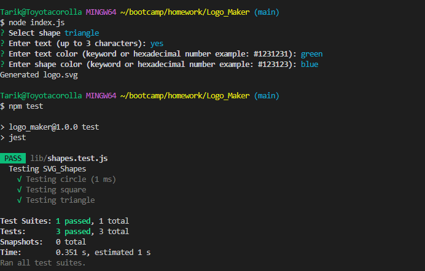

# Logo_Maker

  ## Muhsin Tarik Orgerim

  ## Table of Contents
  - [Description](#description)
  - [Usage](#usage)
  - [License](#license)
  - [Credits](#credits)
  - [Contribute](#contribute)
  

  ## Visuals
  
  

  # Description
  An app that lets user to create their own unique SVG logo(300x200px) with their given input(Shape,text, textcolor, shapeColor)

  ## Usage
  Can be used to create a SVG logo fast.

  ## Installation
  N/A

  ## Credits
  - Rutgers Bootcamp Resources.

  ## Contribute
  - Create a fork of the project
  - Create your branch
  - Make sure to commit your changes
  - Push the branch
  - Do a Pull Request

  ## Deployment
  - Link to my repo: https://github.com/tarikorg/Logo_Maker
  - Link to my Walkthrough video: [WalkThrough](https://drive.google.com/file/d/1u8ULIU17jRtt0lbnQYwFNKD0V0W50HuI/view?usp=sharing)
   
  ## Questions
  - Github username: https://github.com/tarikorg
  - Email: myku1771@gmail.com

  ## License
  This repository is under the MIT license.

